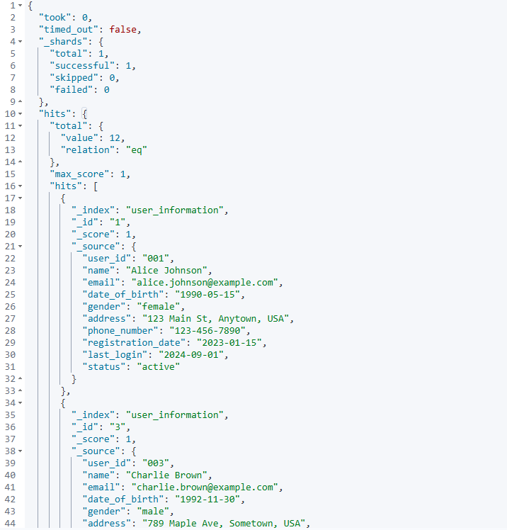
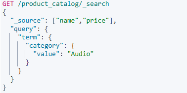
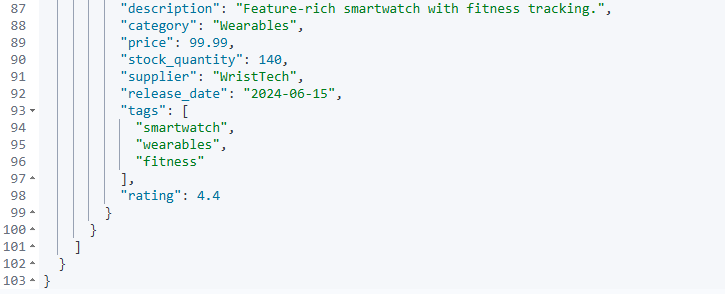
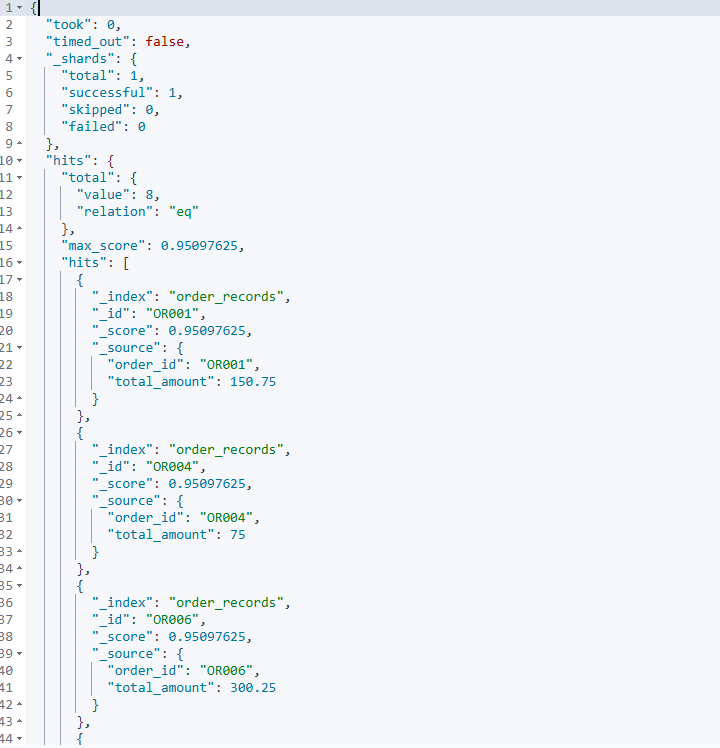
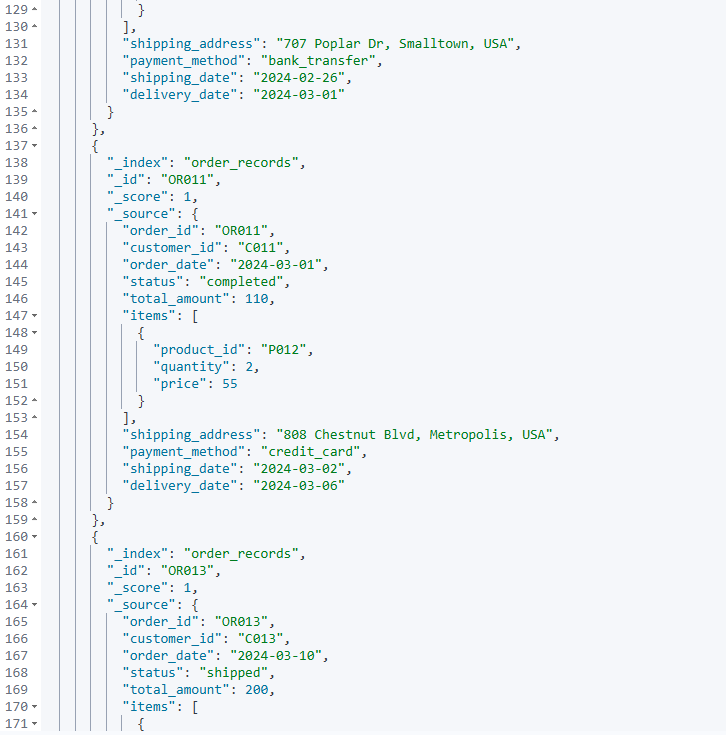
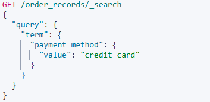
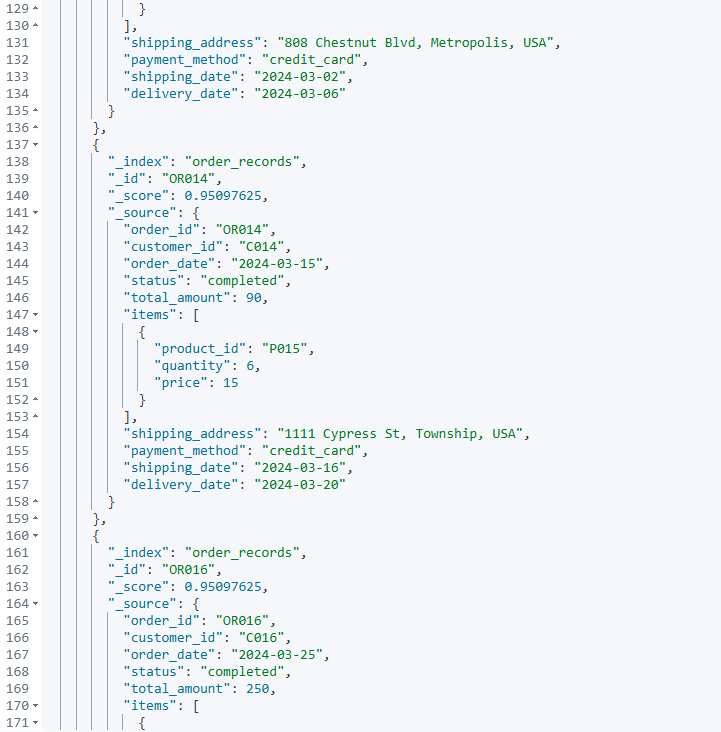

# 《实验二：索引操作与文档操作练习》

##### 学院：省级示范性软件学院

##### 题目：《实验二：索引操作与文档操作练习》

##### 姓名：王承宸

##### 学号：2100a60134

##### 班级：软工2202

##### 日期：2024-09-14

##### 实验环境：ElasticSearch8.12.2、Kibana8.12.2

<h1>一、实验目的</h1>

<h2>1、掌握Elasticsearch 安装IK分词器安装方法</h2>

##### 以下是分词器安装的文件目录截图

<h2>2、掌握Elasticsearch 索引操作方法</h2>

<h2>3、掌握Elasticsearch 文档操作训练</h2>

<h2>4、掌握Elasticsearch 高级查询与DSL训练</h2>

<h1>二、实验内容</h1>

 <h2>1、索引操作练习</h2>

<h3>1.1创建索引</h3>

##### 创建索引指令如下：

##### 创建索引执行结果如下：

<h3>1.2修改索引(自己设计，修改要合理</h3>

##### 向user_information中增加一个number_of_use（使用次数）索引，命令如下：

运行结果如下：

<h3>1.3删除索引</h3>

##### 删除索引的指令如下：

##### 删除索引操作运行结果如下：

<h3>1.4查看所有</h3>

##### 命令如下：

##### 执行结果如下：

## 文档操作练习

### 1.创建文档

##### 向user_infomation中创建一号文档，命令如下：

##### 运行结果如下：

### 2.修改文档

##### 以下是POST更新文档的部分内容的命令：

##### 执行结果如下：

##### 以下是使用PUT更新文档的全部内容的命令：

##### 执行结果如下：

### 3.删除文档

##### 使用DELETE请求来删除1号ID文档，命令如下：

##### 执行结果如下：

### 4.查看文档

##### 在查看文档之前，由于我们刚刚删除了1号文档，所以先进行1号文档的建立，这里省略该步骤

##### 以下是查看1号文档的命令：

##### 执行结果如下：

### 5.将Json数据批量导入ES数据库中

##### 向user_information中传递数据，命令如下：

##### 执行结果如下：

##### 向product_catalog中传递数据，命令如下：

##### 执行结果如下：

##### 向order_records中输入json数据，命令如下：

##### 执行结果如下：

## 高级查询&DSL练习

### 用户信息数据

##### 1.查询所有女性用户的姓名和电子邮件。

命令如下：

执行结果如下：

##### 2.查找最后登录日期在2024年9月1日之后的所有活跃用户。

命令如下：

执行结果如下：

##### 3.查询住在"Anytown"的用户。

命令如下：

执行结果如下：

##### 4.查找出生日期在1990年之后的所有用户。

命令如下：

执行结果如下：

##### 5.查询所有状态为"inactive"的用户。

命令如下：

执行结果如下：

##### 6.查找注册日期在2023年1月1日到2023年12月31日之间的用户。

命令如下：

执行结果如下：

##### 7.查询名字为"Bob Smith"的用户的详细信息。

命令如下：

执行结果如下：

##### 8.查找电话号码以"123"开头的用户。

命令如下：

执行结果如下：

##### 9.查询电子邮件域为"example.com"的所有用户。

命令如下：

执行结果如下：

##### 10.查找所有名字中包含"Lee"的用户。

命令如下：

执行结果如下：

### 产品目录数据

##### 1.查询所有类别为"Audio"的产品名称和价格。

命令如下：

执行结果如下：

##### 2.查找价格高于50美元的所有产品。

命令如下：

执行结果如下：

##### 3.查询库存数量少于100的产品。

命令如下：

执行结果如下：

##### 4.查找评分高于4.5的所有产品。

命令如下：

执行结果如下：

##### 5.查询标签中包含"smart"的所有产品。

命令如下：

执行结果如下：

##### 6.查找供应商为"TechCorp"的产品。

命令如下：

执行结果如下：

##### 7.查询发布日期在2023年6月1日之后的所有产品。

命令如下：

执行结果如下：

##### 8.查找描述中包含"wireless"的产品。

命令如下：

执行结果如下：

##### 9.查询价格在20美元到100美元之间的所有产品。

命令如下：

执行结果如下：

##### 10.查找产品名称中包含"Light"的所有产品。

命令如下：

执行结果如下：

### 订单记录数据

##### 1.查询所有状态为"completed"的订单的订单ID和总金额。

命令如下：

执行结果如下：

##### 2.查找总金额大于100美元的所有订单。

命令如下：

执行结果如下：

##### 3.查询支付方式为"paypal"的订单。

命令如下：

执行结果如下：

##### 4.查找订单日期在2024年2月之后的所有订单。

命令如下：

执行结果如下：

##### 5.查询包含产品ID为"P001"的订单。

命令如下：

执行结果如下：

##### 6.查找所有状态为"cancelled"的订单的客户ID。

命令如下：

执行结果如下：

##### 7.查询发货日期在2024年1月15日之前的订单。

命令如下：

执行结果如下

##### 8.查找使用"credit_card"支付的订单。

命令如下：

执行结果如下：

##### 9.查询总金额在50美元到200美元之间的所有订单。

命令如下：

执行结果如下：

##### 10.查找订单ID中包含"OR01"的所有订单。

命令如下：

执行结果如下：

# 三、**问题及解决方法**

 