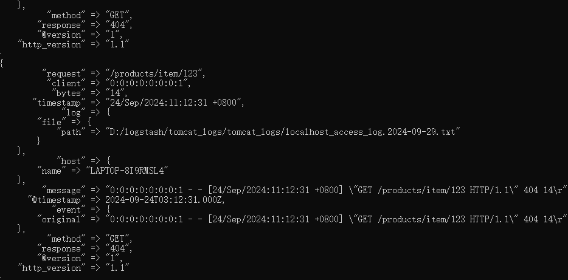

# 《实验四：Logstash操作》


##### 学院：省级示范性软件学院


##### 题目：《实验四：Logstash操作》


##### 姓名：王承宸


##### 学号：2100a60134


##### 班级：软工2202


##### 日期：2024-10-26


##### 实验环境：ElasticSearch 8.12.2、Kibana 8.12.2、Logstash 8.12.2


## 一、tomcat日志处理

### 1. 将tomcat的logs中的localhost_access_log访问日志导入到本地的elasticsearch中，将数据导入到一个名为tomcat_logs的索引。

#### 1.1. 编写配置文件代码

```json
input{
  file{
    path => "D:/logstash/tomcat_logs/tomcat_logs/*.txt" # 日志文件的路径
    start_position => "beginning"
    sincedb_path => "/logstash/tomcat_logs/null" # 不记录读取位置，方便反复测试
  }
}

filter {
  grok {
    match => { "message" => "%{IPV6:client} - - \[%{HTTPDATE:timestamp}\] \"%{WORD:method} %{URIPATH:request} HTTP/%{NUMBER:http_version}\" %{NUMBER:response} (?:%{NUMBER:bytes}|-)" }
  }
  date {
    match => [ "timestamp", "dd/MMM/yyyy:HH:mm:ss Z" ]
  target => "@timestamp"
  }
}

output {
  elasticsearch {
    hosts => ["http://localhost:9200"] # Elasticsearch 地址
    index => "tomcat_logs" # 索引名称
  }
  stdout { codec => rubydebug }  # 输出到控制台，便于调试
}
```

#### 1.2. 运行命令

```cmd
bin\logstash -f .\config\LogToES.conf
```

#### 1.3. 控制台返回结果（仅以一张图为代表）



#### 1.4. 验证结果

##### 1.4.1. 打开Kibana，输入

```json
GET /tomcat_logs/_search
{
  "query": {
    "match_all": {}
  }
}
```

##### 1.4.2. 返回结果

```json
{
  "took": 5,
  "timed_out": false,
  "_shards": {
    "total": 1,
    "successful": 1,
    "skipped": 0,
    "failed": 0
  },
  "hits": {
    "total": {
      "value": 3000,
      "relation": "eq"
    },
    "max_score": 1,
    "hits": [
      {
        "_index": "tomcat_logs",
        "_id": "b8yA0pIBfOtYbIn98ZYQ",
        "_score": 1,
        "_source": {
          "request": "/demo",
          "client": "0:0:0:0:0:0:0:1",
          "bytes": "292",
          "timestamp": "20/Oct/2024:11:12:31 +0800",
          "log": {
            "file": {
              "path": "D:/logstash/tomcat_logs/tomcat_logs/localhost_access_log.2024-10-21.txt"
            }
          },
          "host": {
            "name": "LAPTOP-8I9RMSL4"
          },
          "message": """0:0:0:0:0:0:0:1 - - [20/Oct/2024:11:12:31 +0800] "POST /demo HTTP/1.1" 500 292
""",
          "@timestamp": "2024-10-20T03:12:31.000Z",
          "event": {
            "original": """0:0:0:0:0:0:0:1 - - [20/Oct/2024:11:12:31 +0800] "POST /demo HTTP/1.1" 500 292
"""
          },
          "method": "POST",
          "response": "500",
          "@version": "1",
          "http_version": "1.1"
        }
      },
      {
        "_index": "tomcat_logs",
        "_id": "ccyA0pIBfOtYbIn98ZYQ",
        "_score": 1,
        "_source": {
          "request": "/about",
          "client": "0:0:0:0:0:0:0:1",
          "bytes": "1231",
          "timestamp": "19/Oct/2024:11:12:31 +0800",
          "log": {
            "file": {
              "path": "D:/logstash/tomcat_logs/tomcat_logs/localhost_access_log.2024-10-21.txt"
            }
          },
          "host": {
            "name": "LAPTOP-8I9RMSL4"
          },
          "message": """0:0:0:0:0:0:0:1 - - [19/Oct/2024:11:12:31 +0800] "POST /about HTTP/1.1" 500 1231
""",
          "@timestamp": "2024-10-19T03:12:31.000Z",
          "event": {
            "original": """0:0:0:0:0:0:0:1 - - [19/Oct/2024:11:12:31 +0800] "POST /about HTTP/1.1" 500 1231
"""
          },
          "method": "POST",
          "response": "500",
          "@version": "1",
          "http_version": "1.1"
        }
      },
      {
        "_index": "tomcat_logs",
        "_id": "dsyA0pIBfOtYbIn98ZYQ",
        "_score": 1,
        "_source": {
          "request": "/static/js/app.js",
          "client": "0:0:0:0:0:0:0:1",
          "bytes": "14",
          "timestamp": "12/Oct/2024:11:12:31 +0800",
          "log": {
            "file": {
              "path": "D:/logstash/tomcat_logs/tomcat_logs/localhost_access_log.2024-10-21.txt"
            }
          },
          "host": {
            "name": "LAPTOP-8I9RMSL4"
          },
          "message": """0:0:0:0:0:0:0:1 - - [12/Oct/2024:11:12:31 +0800] "POST /static/js/app.js HTTP/1.1" 302 14
""",
          "@timestamp": "2024-10-12T03:12:31.000Z",
          "event": {
            "original": """0:0:0:0:0:0:0:1 - - [12/Oct/2024:11:12:31 +0800] "POST /static/js/app.js HTTP/1.1" 302 14
"""
          },
          "method": "POST",
          "response": "302",
          "@version": "1",
          "http_version": "1.1"
        }
      },
      {
        "_index": "tomcat_logs",
        "_id": "fcyA0pIBfOtYbIn98ZYQ",
        "_score": 1,
        "_source": {
          "request": "/examples/jsp/images/execute.gif",
          "client": "0:0:0:0:0:0:0:1",
          "bytes": "292",
          "timestamp": "12/Oct/2024:11:12:31 +0800",
          "log": {
            "file": {
              "path": "D:/logstash/tomcat_logs/tomcat_logs/localhost_access_log.2024-10-21.txt"
            }
          },
          "host": {
            "name": "LAPTOP-8I9RMSL4"
          },
          "message": """0:0:0:0:0:0:0:1 - - [12/Oct/2024:11:12:31 +0800] "POST /examples/jsp/images/execute.gif HTTP/1.1" 404 292
""",
          "@timestamp": "2024-10-12T03:12:31.000Z",
          "event": {
            "original": """0:0:0:0:0:0:0:1 - - [12/Oct/2024:11:12:31 +0800] "POST /examples/jsp/images/execute.gif HTTP/1.1" 404 292
"""
          },
          "method": "POST",
          "response": "404",
          "@version": "1",
          "http_version": "1.1"
        }
      },
      {
        "_index": "tomcat_logs",
        "_id": "g8yA0pIBfOtYbIn98ZYQ",
        "_score": 1,
        "_source": {
          "request": "/api/products/list",
          "client": "0:0:0:0:0:0:0:1",
          "bytes": "1242",
          "timestamp": "27/Sep/2024:11:12:31 +0800",
          "log": {
            "file": {
              "path": "D:/logstash/tomcat_logs/tomcat_logs/localhost_access_log.2024-10-21.txt"
            }
          },
          "host": {
            "name": "LAPTOP-8I9RMSL4"
          },
          "message": """0:0:0:0:0:0:0:1 - - [27/Sep/2024:11:12:31 +0800] "POST /api/products/list HTTP/1.1" 500 1242
""",
          "@timestamp": "2024-09-27T03:12:31.000Z",
          "event": {
            "original": """0:0:0:0:0:0:0:1 - - [27/Sep/2024:11:12:31 +0800] "POST /api/products/list HTTP/1.1" 500 1242
"""
          },
          "method": "POST",
          "response": "500",
          "@version": "1",
          "http_version": "1.1"
        }
      },
      {
        "_index": "tomcat_logs",
        "_id": "i8yA0pIBfOtYbIn98ZYQ",
        "_score": 1,
        "_source": {
          "request": "/blog/post/2",
          "client": "0:0:0:0:0:0:0:1",
          "bytes": "1231",
          "timestamp": "11/Oct/2024:11:12:31 +0800",
          "log": {
            "file": {
              "path": "D:/logstash/tomcat_logs/tomcat_logs/localhost_access_log.2024-10-21.txt"
            }
          },
          "host": {
            "name": "LAPTOP-8I9RMSL4"
          },
          "message": """0:0:0:0:0:0:0:1 - - [11/Oct/2024:11:12:31 +0800] "GET /blog/post/2 HTTP/1.1" 500 1231
""",
          "@timestamp": "2024-10-11T03:12:31.000Z",
          "event": {
            "original": """0:0:0:0:0:0:0:1 - - [11/Oct/2024:11:12:31 +0800] "GET /blog/post/2 HTTP/1.1" 500 1231
"""
          },
          "method": "GET",
          "response": "500",
          "@version": "1",
          "http_version": "1.1"
        }
      },
      {
        "_index": "tomcat_logs",
        "_id": "lcyA0pIBfOtYbIn98ZYQ",
        "_score": 1,
        "_source": {
          "request": "/services",
          "client": "0:0:0:0:0:0:0:1",
          "bytes": "99",
          "timestamp": "11/Oct/2024:11:12:31 +0800",
          "log": {
            "file": {
              "path": "D:/logstash/tomcat_logs/tomcat_logs/localhost_access_log.2024-10-19.txt"
            }
          },
          "host": {
            "name": "LAPTOP-8I9RMSL4"
          },
          "message": """0:0:0:0:0:0:0:1 - - [11/Oct/2024:11:12:31 +0800] "POST /services HTTP/1.1" 302 99
""",
          "@timestamp": "2024-10-11T03:12:31.000Z",
          "event": {
            "original": """0:0:0:0:0:0:0:1 - - [11/Oct/2024:11:12:31 +0800] "POST /services HTTP/1.1" 302 99
"""
          },
          "method": "POST",
          "response": "302",
          "@version": "1",
          "http_version": "1.1"
        }
      },
      {
        "_index": "tomcat_logs",
        "_id": "nsyA0pIBfOtYbIn98ZYQ",
        "_score": 1,
        "_source": {
          "request": "/api/products/list",
          "client": "0:0:0:0:0:0:0:1",
          "bytes": "14",
          "timestamp": "28/Sep/2024:11:12:31 +0800",
          "log": {
            "file": {
              "path": "D:/logstash/tomcat_logs/tomcat_logs/localhost_access_log.2024-10-19.txt"
            }
          },
          "host": {
            "name": "LAPTOP-8I9RMSL4"
          },
          "message": """0:0:0:0:0:0:0:1 - - [28/Sep/2024:11:12:31 +0800] "GET /api/products/list HTTP/1.1" 200 14
""",
          "@timestamp": "2024-09-28T03:12:31.000Z",
          "event": {
            "original": """0:0:0:0:0:0:0:1 - - [28/Sep/2024:11:12:31 +0800] "GET /api/products/list HTTP/1.1" 200 14
"""
          },
          "method": "GET",
          "response": "200",
          "@version": "1",
          "http_version": "1.1"
        }
      },
      {
        "_index": "tomcat_logs",
        "_id": "psyA0pIBfOtYbIn98ZYQ",
        "_score": 1,
        "_source": {
          "request": "/blog/post/2",
          "client": "0:0:0:0:0:0:0:1",
          "bytes": "99",
          "timestamp": "16/Oct/2024:11:12:31 +0800",
          "log": {
            "file": {
              "path": "D:/logstash/tomcat_logs/tomcat_logs/localhost_access_log.2024-10-19.txt"
            }
          },
          "host": {
            "name": "LAPTOP-8I9RMSL4"
          },
          "message": """0:0:0:0:0:0:0:1 - - [16/Oct/2024:11:12:31 +0800] "GET /blog/post/2 HTTP/1.1" 404 99
""",
          "@timestamp": "2024-10-16T03:12:31.000Z",
          "event": {
            "original": """0:0:0:0:0:0:0:1 - - [16/Oct/2024:11:12:31 +0800] "GET /blog/post/2 HTTP/1.1" 404 99
"""
          },
          "method": "GET",
          "response": "404",
          "@version": "1",
          "http_version": "1.1"
        }
      },
      {
        "_index": "tomcat_logs",
        "_id": "sMyA0pIBfOtYbIn98ZYQ",
        "_score": 1,
        "_source": {
          "request": "/products/item/789",
          "client": "0:0:0:0:0:0:0:1",
          "bytes": "14",
          "timestamp": "16/Oct/2024:11:12:31 +0800",
          "log": {
            "file": {
              "path": "D:/logstash/tomcat_logs/tomcat_logs/localhost_access_log.2024-10-19.txt"
            }
          },
          "host": {
            "name": "LAPTOP-8I9RMSL4"
          },
          "message": """0:0:0:0:0:0:0:1 - - [16/Oct/2024:11:12:31 +0800] "GET /products/item/789 HTTP/1.1" 500 14
""",
          "@timestamp": "2024-10-16T03:12:31.000Z",
          "event": {
            "original": """0:0:0:0:0:0:0:1 - - [16/Oct/2024:11:12:31 +0800] "GET /products/item/789 HTTP/1.1" 500 14
"""
          },
          "method": "GET",
          "response": "500",
          "@version": "1",
          "http_version": "1.1"
        }
      }
    ]
  }
}
```

### 2. 在elasticsearch中进行5个日志相关的分析

#### 2.1. 对响应状态进行分析，查找响应次数前十的响应状态

##### 代码如下：

```json
GET /tomcat_logs/_search
{
  "size": 0,
  "aggs": {
    "status_codes": {
      "terms": {
        "field": "response.keyword",
        "size": 10
      }
    }
  }
}
```

##### 返回结果如下：

```json
{
  "took": 4,
  "timed_out": false,
  "_shards": {
    "total": 1,
    "successful": 1,
    "skipped": 0,
    "failed": 0
  },
  "hits": {
    "total": {
      "value": 3000,
      "relation": "eq"
    },
    "max_score": null,
    "hits": []
  },
  "aggregations": {
    "status_codes": {
      "doc_count_error_upper_bound": 0,
      "sum_other_doc_count": 0,
      "buckets": [
        {
          "key": "500",
          "doc_count": 781
        },
        {
          "key": "200",
          "doc_count": 749
        },
        {
          "key": "404",
          "doc_count": 738
        },
        {
          "key": "302",
          "doc_count": 732
        }
      ]
    }
  }
}
```

#### 2.2. 时间序列分析，查询前十的每日访问数

##### 代码如下：

```json
GET /tomcat_logs/_search
{
  "size": 0, // 只返回聚合结果
  "aggs": {
    "requests_over_time": {
      "terms": {
        "field": "@timestamp",
        "size": 10
      }
    }
  }
}
```

##### 返回结果如下：

```json
{
  "took": 0,
  "timed_out": false,
  "_shards": {
    "total": 1,
    "successful": 1,
    "skipped": 0,
    "failed": 0
  },
  "hits": {
    "total": {
      "value": 3000,
      "relation": "eq"
    },
    "max_score": null,
    "hits": []
  },
  "aggregations": {
    "requests_over_time": {
      "doc_count_error_upper_bound": 0,
      "sum_other_doc_count": 2078,
      "buckets": [
        {
          "key": 1726801951000,
          "key_as_string": "2024-09-20T03:12:31.000Z",
          "doc_count": 102
        },
        {
          "key": 1727320351000,
          "key_as_string": "2024-09-26T03:12:31.000Z",
          "doc_count": 101
        },
        {
          "key": 1727406751000,
          "key_as_string": "2024-09-27T03:12:31.000Z",
          "doc_count": 99
        },
        {
          "key": 1726715551000,
          "key_as_string": "2024-09-19T03:12:31.000Z",
          "doc_count": 95
        },
        {
          "key": 1726542751000,
          "key_as_string": "2024-09-17T03:12:31.000Z",
          "doc_count": 94
        },
        {
          "key": 1727147551000,
          "key_as_string": "2024-09-24T03:12:31.000Z",
          "doc_count": 90
        },
        {
          "key": 1727579551000,
          "key_as_string": "2024-09-29T03:12:31.000Z",
          "doc_count": 89
        },
        {
          "key": 1727061151000,
          "key_as_string": "2024-09-23T03:12:31.000Z",
          "doc_count": 85
        },
        {
          "key": 1727233951000,
          "key_as_string": "2024-09-25T03:12:31.000Z",
          "doc_count": 84
        },
        {
          "key": 1726456351000,
          "key_as_string": "2024-09-16T03:12:31.000Z",
          "doc_count": 83
        }
      ]
    }
  }
}
```


#### 2.3. 统计请求数

##### 代码如下：

```json
GET /tomcat_logs/_search
{
  "size": 0,
  "aggs": {
    "top10_method": {
      "terms": {
        "field": "method.keyword"
      }
    }
  }
}
```

##### 返回结果如下：

```json
{
  "took": 1,
  "timed_out": false,
  "_shards": {
    "total": 1,
    "successful": 1,
    "skipped": 0,
    "failed": 0
  },
  "hits": {
    "total": {
      "value": 3000,
      "relation": "eq"
    },
    "max_score": null,
    "hits": []
  },
  "aggregations": {
    "top10_method": {
      "doc_count_error_upper_bound": 0,
      "sum_other_doc_count": 0,
      "buckets": [
        {
          "key": "POST",
          "doc_count": 1547
        },
        {
          "key": "GET",
          "doc_count": 1453
        }
      ]
    }
  }
}
```

#### 2.4. 异常ip检测

##### 代码如下：

```json
GET /tomcat_logs/_search
{
  "size": 0,
  "query": {
    "range": {
      "response.keyword": {
        "gte": 400
      }
    }
  },
  "aggs": {
    "suspicious_ips": {
      "terms": {
        "field": "client.keyword",
        "size": 10
      }
    }
  }
}
```

##### 返回结果如下：

```json
{
  "took": 1,
  "timed_out": false,
  "_shards": {
    "total": 1,
    "successful": 1,
    "skipped": 0,
    "failed": 0
  },
  "hits": {
    "total": {
      "value": 1519,
      "relation": "eq"
    },
    "max_score": null,
    "hits": []
  },
  "aggregations": {
    "suspicious_ips": {
      "doc_count_error_upper_bound": 0,
      "sum_other_doc_count": 0,
      "buckets": [
        {
          "key": "0:0:0:0:0:0:0:1",
          "doc_count": 1519
        }
      ]
    }
  }
}
```

#### 2.5. 查看返回字节情况，从高到低排序输出十个

##### 代码如下：

```json
GET /tomcat_logs/_search
{
  "aggs": {
    "top10_bytes": {
      "terms": {
        "field": "bytes.keyword",
        "order": {
          "_key": "desc"
        },
        "size": 10
      }
    }
  }
}
```

##### 返回结果如下：

```json
{
  "took": 2,
  "timed_out": false,
  "_shards": {
    "total": 1,
    "successful": 1,
    "skipped": 0,
    "failed": 0
  },
  "hits": {
    "total": {
      "value": 3000,
      "relation": "eq"
    },
    "max_score": 1,
    "hits": [
      {
        "_index": "tomcat_logs",
        "_id": "b8yA0pIBfOtYbIn98ZYQ",
        "_score": 1,
        "_source": {
          "request": "/demo",
          "client": "0:0:0:0:0:0:0:1",
          "bytes": "292",
          "timestamp": "20/Oct/2024:11:12:31 +0800",
          "log": {
            "file": {
              "path": "D:/logstash/tomcat_logs/tomcat_logs/localhost_access_log.2024-10-21.txt"
            }
          },
          "host": {
            "name": "LAPTOP-8I9RMSL4"
          },
          "message": """0:0:0:0:0:0:0:1 - - [20/Oct/2024:11:12:31 +0800] "POST /demo HTTP/1.1" 500 292
""",
          "@timestamp": "2024-10-20T03:12:31.000Z",
          "event": {
            "original": """0:0:0:0:0:0:0:1 - - [20/Oct/2024:11:12:31 +0800] "POST /demo HTTP/1.1" 500 292
"""
          },
          "method": "POST",
          "response": "500",
          "@version": "1",
          "http_version": "1.1"
        }
      },
      {
        "_index": "tomcat_logs",
        "_id": "ccyA0pIBfOtYbIn98ZYQ",
        "_score": 1,
        "_source": {
          "request": "/about",
          "client": "0:0:0:0:0:0:0:1",
          "bytes": "1231",
          "timestamp": "19/Oct/2024:11:12:31 +0800",
          "log": {
            "file": {
              "path": "D:/logstash/tomcat_logs/tomcat_logs/localhost_access_log.2024-10-21.txt"
            }
          },
          "host": {
            "name": "LAPTOP-8I9RMSL4"
          },
          "message": """0:0:0:0:0:0:0:1 - - [19/Oct/2024:11:12:31 +0800] "POST /about HTTP/1.1" 500 1231
""",
          "@timestamp": "2024-10-19T03:12:31.000Z",
          "event": {
            "original": """0:0:0:0:0:0:0:1 - - [19/Oct/2024:11:12:31 +0800] "POST /about HTTP/1.1" 500 1231
"""
          },
          "method": "POST",
          "response": "500",
          "@version": "1",
          "http_version": "1.1"
        }
      },
      {
        "_index": "tomcat_logs",
        "_id": "dsyA0pIBfOtYbIn98ZYQ",
        "_score": 1,
        "_source": {
          "request": "/static/js/app.js",
          "client": "0:0:0:0:0:0:0:1",
          "bytes": "14",
          "timestamp": "12/Oct/2024:11:12:31 +0800",
          "log": {
            "file": {
              "path": "D:/logstash/tomcat_logs/tomcat_logs/localhost_access_log.2024-10-21.txt"
            }
          },
          "host": {
            "name": "LAPTOP-8I9RMSL4"
          },
          "message": """0:0:0:0:0:0:0:1 - - [12/Oct/2024:11:12:31 +0800] "POST /static/js/app.js HTTP/1.1" 302 14
""",
          "@timestamp": "2024-10-12T03:12:31.000Z",
          "event": {
            "original": """0:0:0:0:0:0:0:1 - - [12/Oct/2024:11:12:31 +0800] "POST /static/js/app.js HTTP/1.1" 302 14
"""
          },
          "method": "POST",
          "response": "302",
          "@version": "1",
          "http_version": "1.1"
        }
      },
      {
        "_index": "tomcat_logs",
        "_id": "fcyA0pIBfOtYbIn98ZYQ",
        "_score": 1,
        "_source": {
          "request": "/examples/jsp/images/execute.gif",
          "client": "0:0:0:0:0:0:0:1",
          "bytes": "292",
          "timestamp": "12/Oct/2024:11:12:31 +0800",
          "log": {
            "file": {
              "path": "D:/logstash/tomcat_logs/tomcat_logs/localhost_access_log.2024-10-21.txt"
            }
          },
          "host": {
            "name": "LAPTOP-8I9RMSL4"
          },
          "message": """0:0:0:0:0:0:0:1 - - [12/Oct/2024:11:12:31 +0800] "POST /examples/jsp/images/execute.gif HTTP/1.1" 404 292
""",
          "@timestamp": "2024-10-12T03:12:31.000Z",
          "event": {
            "original": """0:0:0:0:0:0:0:1 - - [12/Oct/2024:11:12:31 +0800] "POST /examples/jsp/images/execute.gif HTTP/1.1" 404 292
"""
          },
          "method": "POST",
          "response": "404",
          "@version": "1",
          "http_version": "1.1"
        }
      },
      {
        "_index": "tomcat_logs",
        "_id": "g8yA0pIBfOtYbIn98ZYQ",
        "_score": 1,
        "_source": {
          "request": "/api/products/list",
          "client": "0:0:0:0:0:0:0:1",
          "bytes": "1242",
          "timestamp": "27/Sep/2024:11:12:31 +0800",
          "log": {
            "file": {
              "path": "D:/logstash/tomcat_logs/tomcat_logs/localhost_access_log.2024-10-21.txt"
            }
          },
          "host": {
            "name": "LAPTOP-8I9RMSL4"
          },
          "message": """0:0:0:0:0:0:0:1 - - [27/Sep/2024:11:12:31 +0800] "POST /api/products/list HTTP/1.1" 500 1242
""",
          "@timestamp": "2024-09-27T03:12:31.000Z",
          "event": {
            "original": """0:0:0:0:0:0:0:1 - - [27/Sep/2024:11:12:31 +0800] "POST /api/products/list HTTP/1.1" 500 1242
"""
          },
          "method": "POST",
          "response": "500",
          "@version": "1",
          "http_version": "1.1"
        }
      },
      {
        "_index": "tomcat_logs",
        "_id": "i8yA0pIBfOtYbIn98ZYQ",
        "_score": 1,
        "_source": {
          "request": "/blog/post/2",
          "client": "0:0:0:0:0:0:0:1",
          "bytes": "1231",
          "timestamp": "11/Oct/2024:11:12:31 +0800",
          "log": {
            "file": {
              "path": "D:/logstash/tomcat_logs/tomcat_logs/localhost_access_log.2024-10-21.txt"
            }
          },
          "host": {
            "name": "LAPTOP-8I9RMSL4"
          },
          "message": """0:0:0:0:0:0:0:1 - - [11/Oct/2024:11:12:31 +0800] "GET /blog/post/2 HTTP/1.1" 500 1231
""",
          "@timestamp": "2024-10-11T03:12:31.000Z",
          "event": {
            "original": """0:0:0:0:0:0:0:1 - - [11/Oct/2024:11:12:31 +0800] "GET /blog/post/2 HTTP/1.1" 500 1231
"""
          },
          "method": "GET",
          "response": "500",
          "@version": "1",
          "http_version": "1.1"
        }
      },
      {
        "_index": "tomcat_logs",
        "_id": "lcyA0pIBfOtYbIn98ZYQ",
        "_score": 1,
        "_source": {
          "request": "/services",
          "client": "0:0:0:0:0:0:0:1",
          "bytes": "99",
          "timestamp": "11/Oct/2024:11:12:31 +0800",
          "log": {
            "file": {
              "path": "D:/logstash/tomcat_logs/tomcat_logs/localhost_access_log.2024-10-19.txt"
            }
          },
          "host": {
            "name": "LAPTOP-8I9RMSL4"
          },
          "message": """0:0:0:0:0:0:0:1 - - [11/Oct/2024:11:12:31 +0800] "POST /services HTTP/1.1" 302 99
""",
          "@timestamp": "2024-10-11T03:12:31.000Z",
          "event": {
            "original": """0:0:0:0:0:0:0:1 - - [11/Oct/2024:11:12:31 +0800] "POST /services HTTP/1.1" 302 99
"""
          },
          "method": "POST",
          "response": "302",
          "@version": "1",
          "http_version": "1.1"
        }
      },
      {
        "_index": "tomcat_logs",
        "_id": "nsyA0pIBfOtYbIn98ZYQ",
        "_score": 1,
        "_source": {
          "request": "/api/products/list",
          "client": "0:0:0:0:0:0:0:1",
          "bytes": "14",
          "timestamp": "28/Sep/2024:11:12:31 +0800",
          "log": {
            "file": {
              "path": "D:/logstash/tomcat_logs/tomcat_logs/localhost_access_log.2024-10-19.txt"
            }
          },
          "host": {
            "name": "LAPTOP-8I9RMSL4"
          },
          "message": """0:0:0:0:0:0:0:1 - - [28/Sep/2024:11:12:31 +0800] "GET /api/products/list HTTP/1.1" 200 14
""",
          "@timestamp": "2024-09-28T03:12:31.000Z",
          "event": {
            "original": """0:0:0:0:0:0:0:1 - - [28/Sep/2024:11:12:31 +0800] "GET /api/products/list HTTP/1.1" 200 14
"""
          },
          "method": "GET",
          "response": "200",
          "@version": "1",
          "http_version": "1.1"
        }
      },
      {
        "_index": "tomcat_logs",
        "_id": "psyA0pIBfOtYbIn98ZYQ",
        "_score": 1,
        "_source": {
          "request": "/blog/post/2",
          "client": "0:0:0:0:0:0:0:1",
          "bytes": "99",
          "timestamp": "16/Oct/2024:11:12:31 +0800",
          "log": {
            "file": {
              "path": "D:/logstash/tomcat_logs/tomcat_logs/localhost_access_log.2024-10-19.txt"
            }
          },
          "host": {
            "name": "LAPTOP-8I9RMSL4"
          },
          "message": """0:0:0:0:0:0:0:1 - - [16/Oct/2024:11:12:31 +0800] "GET /blog/post/2 HTTP/1.1" 404 99
""",
          "@timestamp": "2024-10-16T03:12:31.000Z",
          "event": {
            "original": """0:0:0:0:0:0:0:1 - - [16/Oct/2024:11:12:31 +0800] "GET /blog/post/2 HTTP/1.1" 404 99
"""
          },
          "method": "GET",
          "response": "404",
          "@version": "1",
          "http_version": "1.1"
        }
      },
      {
        "_index": "tomcat_logs",
        "_id": "sMyA0pIBfOtYbIn98ZYQ",
        "_score": 1,
        "_source": {
          "request": "/products/item/789",
          "client": "0:0:0:0:0:0:0:1",
          "bytes": "14",
          "timestamp": "16/Oct/2024:11:12:31 +0800",
          "log": {
            "file": {
              "path": "D:/logstash/tomcat_logs/tomcat_logs/localhost_access_log.2024-10-19.txt"
            }
          },
          "host": {
            "name": "LAPTOP-8I9RMSL4"
          },
          "message": """0:0:0:0:0:0:0:1 - - [16/Oct/2024:11:12:31 +0800] "GET /products/item/789 HTTP/1.1" 500 14
""",
          "@timestamp": "2024-10-16T03:12:31.000Z",
          "event": {
            "original": """0:0:0:0:0:0:0:1 - - [16/Oct/2024:11:12:31 +0800] "GET /products/item/789 HTTP/1.1" 500 14
"""
          },
          "method": "GET",
          "response": "500",
          "@version": "1",
          "http_version": "1.1"
        }
      }
    ]
  },
  "aggregations": {
    "top10_bytes": {
      "doc_count_error_upper_bound": 0,
      "sum_other_doc_count": 0,
      "buckets": [
        {
          "key": "99",
          "doc_count": 429
        },
        {
          "key": "292",
          "doc_count": 447
        },
        {
          "key": "14",
          "doc_count": 425
        },
        {
          "key": "13",
          "doc_count": 421
        },
        {
          "key": "1242",
          "doc_count": 446
        },
        {
          "key": "1231",
          "doc_count": 427
        },
        {
          "key": "0",
          "doc_count": 405
        }
      ]
    }
  }
}
```

## 二、数据转换和传输

### 1. 将本地的mysql数据库中的一张表导入到本地的elasticsearch中。

#### 1.1. 编写配置文件代码

```json
input {
  jdbc {
    jdbc_driver_library => "D:/software/logstash-8.12.2/jars/mysql-connector-j-9.1.0.jar"
    jdbc_driver_class => "com.mysql.cj.jdbc.Driver"
    jdbc_connection_string => "jdbc:mysql://localhost:3306/jdbc_demo"
    jdbc_user => "root"
    jdbc_password => "chengchen@1"
    statement => "SELECT * FROM teacher"
    schedule => "*/5 * * * * *" # 每5秒运行一次
  }
}

output {
  elasticsearch {
    hosts => ["http://localhost:9200"]
    index => "teachers"
    document_id => "%{id}" # 假设 student 表有一个 id 字段作为主键
  }
  stdout { codec => json_lines }
}
```

#### 1.2. 运行命令

```cmd
bin\logstash -f .\config\MysqlToES.conf
```


#### 1.3. 控制台返回结果（仅以一张图为代表）


#### 1.4. 验证结果

##### 1.4.1. 打开Kibana，输入

```json
GET /teachers/_search
{
  "query": {
    "match_all": {}
  }
}
```

##### 1.4.2. 返回结果（以一张图作为代表）


##### 可以查询到所有总计500条信息全部录入了ES中。

### 2. 数据库表更新后，数据能够自动同步到elasticsearch中。

#### 在数据库中插入一条数据


#### 可以看到在ES中也同步更新该数据

```json
{
  "took": 2187,
  "timed_out": false,
  "_shards": {
    "total": 1,
    "successful": 1,
    "skipped": 0,
    "failed": 0
  },
  "hits": {
    "total": {
      "value": 1,
      "relation": "eq"
    },
    "max_score": 1,
    "hits": [
      {
        "_index": "teachers",
        "_id": "501",
        "_score": 1,
        "_source": {
          "id": 501,
          "birthday": "2024-10-27T16:00:00.000Z",
          "course": "course501",
          "@version": "1",
          "@timestamp": "2024-10-28T10:25:00.338540500Z",
          "name": "name501"
        }
      }
    ]
  }
}
```

